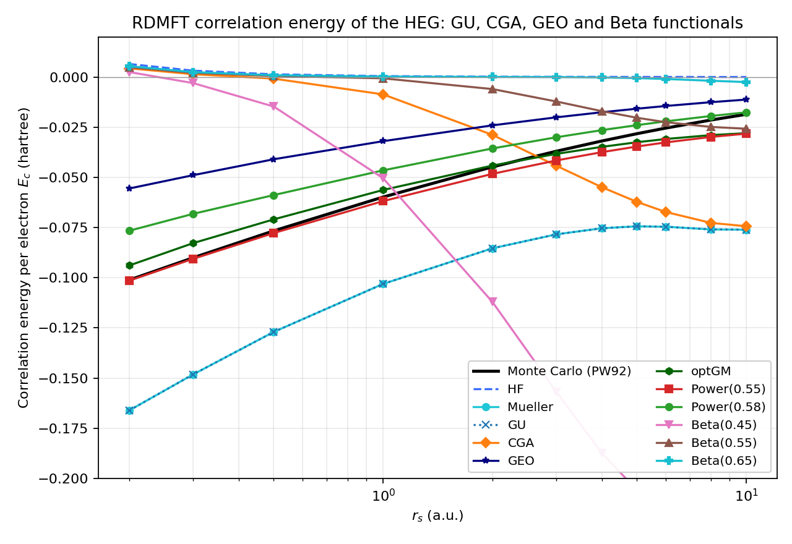

# RDMFT_HEG_Correlation

均匀电子气（Homogeneous Electron Gas, HEG）的简约密度矩阵泛函理论
（Reduced Density Matrix Functional Theory, RDMFT）C++ 程序。本项目以模块化
的方式实现了若干个常见的 RDMFT 关联泛函（Hartree–Fock、Müller、Power 系列、
BBC1 …），并将得到的关联能 `E_c(r_s)` 与量子蒙特卡洛 (QMC) 的 PW92 参数化
结果作对比，便于后续设计新泛函并复现常见基准图。



上图为本程序在默认参数下生成的 `figures/correlation_energy.png`，与文献中
RDMFT 经典对比图的整体形貌一致：

| 泛函 | `r_s = 1` 处 `E_c` (Ha) | `r_s = 5` 处 `E_c` (Ha) |
|---|---|---|
| QMC (PW92) | −0.0598 | −0.0282 |
| Power(α=0.55) | −0.0618 | −0.0346 |
| Power(α=0.58) | −0.0465 | −0.0240 |
| Müller (α=0.5) | −0.103 | −0.074 |
| HF | ~0 | ~0 |

---

## 1. 物理与数值方案

### 1.1 总能量泛函

对自旋无极化（顺磁）HEG，自然轨道为平面波，其每自旋占据数 `n(k) ∈ [0, 1]`
仅依赖 `|k|`。在原子单位下，每单位体积的能量为

```
T/V    = (1 / (2π²)) ∫₀^∞ k⁴   n(k) dk
E_xc/V = -(1 / (2π³)) ∬₀^∞ k k' K(n(k), n(k'))
                           · ln|(k+k')/(k-k')| dk dk'
ρ      = (1 / π²)   ∫₀^∞ k²   n(k) dk
```

其中两体核 `K(n_i, n_j)` 决定了具体的 RDMFT 泛函。Power 族给出
`K = f(n_i) f(n_j)`，`f(n) = n^α`：

* HF（精确交换） &nbsp;⇔ `α = 1`
* Müller / BB &nbsp;⇔ `α = 1/2`
* Power（Sharma 等） &nbsp;⇔ `α ∈ (0, 1)`，常用 `0.55 ~ 0.58`
* GU（Goedecker–Umrigar 1998） &nbsp;⇔ Müller 的 `α=1/2` 形式
  外加去除单轨道自相互作用；在 HEG（平面波）极限下与 Müller 相同。

不可分（非乘积）核也已实现：

* **BBC1**（Gritsenko–Pernal–Baerends 2005）：弱占据态对加负号。
* **CGA**（Csányi–Goedecker–Arias，*Phys. Rev. A* **65**, 032510 (2002)）：

  ```
  K_CGA(n_i, n_j) = n_i n_j  +  sqrt(n_i (1 - n_i)) * sqrt(n_j (1 - n_j))
  ```

  为 HF 交换加上一个空穴/统计相关贡献，对高密度 HEG 表现良好。

* **GEO**（本项目新增）：多次幂"几何均值"型核

  ```
  K_GEO(n_p, n_q) = [ n_p n_q + (n_p n_q)^{1/2} + 2 (n_p n_q)^{3/4} ] / 4
  ```

  即 HF 核 (`alpha = 1`)、Mueller 核 (`alpha = 1/2`) 与 Power(3/4) 核
  以权重 `1 : 1 : 2` 等比例混合，并归一使 `K_GEO(1, 1) = 1`（与 HF 的
  饱和极限一致）。该核非可分，但 Euler–Lagrange 方程的左侧在 `n_i` 上
  是单调递减函数（前提是 `U_alpha,i >= 0`），因此可对每个网格点用
  一维二分把 `n_i` 反解出来；外层照常用 `mu` 二分满足密度约束。

* **optGM**（optimized geometric mean）：与 GEO 相同的三条通道
  `n_i n_j`、`(n_i n_j)^{1/2}`、`(n_i n_j)^{3/4}`，但混合权重为
  `w1=a^2`、`w2=b^2`、`w3=c^2`，其中 `(a,b,c)` 在单位球面上（程序会对输入
  做归一化，使 `a^2+b^2+c^2=1`，从而 `K(1,1)=1`）。CLI 使用分号分隔角度
  （因为 `--funcs` 列表本身用逗号分隔），例如
  `OptGM@0.5;0.70710678;0.5`。可用 `python3 scripts/optimize_optGM.py` 在 PW92
  参考下拟合 `(a,b,c)`（默认先做少量粗网格 prescreen 再松收敛；`--quiet` 减少输出，
  `--verbose` 打印 C++ 标准输出；仅需 NumPy，可选 SciPy）。

* **Beta**：将 CGA 的空穴部分推广为可调指数

  ```
  K_beta(n_i, n_j) = n_i n_j + [ n_i (1 - n_i) * n_j (1 - n_j) ]^beta
  ```

  默认运行三个 `beta` 值（`0.45 / 0.55 / 0.65`）以演示其在 HF
  与 CGA 之间的插值行为：

  * `beta -> +infinity` &nbsp;⇒ 纯 HF；
  * `beta = 1/2` &nbsp;⇒ 与 CGA 相同；
  * `beta < 1/2` &nbsp;⇒ 空穴贡献变强，相关性更强（Müller 极限方向）。

### 1.2 数值积分

最大的数值难点是 `ln|(k+k')/(k-k')|` 在 `k = k'` 处的可积对数奇异性。
直接的梯形/Simpson 积分在该奇异点附近收敛极慢。本项目采用
**乘积积分（product integration）**：

* 在分段网格上把 `k' f(n(k'))` 视为分段线性函数。
* 对每个区间上的 `ln(k_i + k')` 与 `ln|k_i − k'|`
  关于线性帽函数的积分用解析原函数 `t ln|t| − t`、
  `½ t² ln|t| − ¼ t²` 直接计算。

由此得到一个稠密矩阵 `W[i, j]`，使得

```
V_i = Σ_j W[i, j] k_j K(n_i, n_j),
E_xc/V = −(1 / (2π³)) Σ_i w_i k_i V_i.
```

对于 HF 阶跃占据数，这种积分方法在 401 个网格点下相对于解析结果
（`e_x = −3 k_F / (4π)`）的误差已优于 `10⁻⁴`。

### 1.3 自洽求解

基本算法是 Euler–Lagrange 方程

```
δ(T + E_xc)/δn_i  =  μ · δρ/δn_i        ( 0 < n_i < 1 )
```

并辅以约束 `n_i ∈ [0, 1]`。

* 对 Power 族（核可分离），一步 Euler–Lagrange 解析地给出 `n_i`，
  外层用二分法把 `μ` 调整到密度约束。
* 对一般的非可分核，使用投影梯度（projected gradient）作为兜底。

两种分支都通过混合（mixing）+ 二分 `μ` 的方式收敛到稳态。

### 1.4 关联能定义

按照惯例，本程序在输出文件中的 `Ec_per_N` 列由
`E_c^RDMFT = E^RDMFT − E^HF`（每电子，单位 Hartree）给出，HF 解析能量为

```
e_HF = (3/10) k_F² − (3/(4π)) k_F,    k_F = (9π/4)^{1/3} / r_s.
```

QMC 参考由 PW92 拟合（`include/QMC.hpp`）给出。

---

## 2. 项目结构

```
.
├── include/
│   ├── HEG.hpp              # 几何/解析公式（k_F、ρ、HF 能等）
│   ├── Grid.hpp             # 一维 k 空间网格 + 积分权重
│   ├── ExchangeKernel.hpp   # log-奇异核的乘积积分
│   ├── Functional.hpp       # 泛函抽象基类 + HF / Müller / Power / BBC1
│   ├── Energy.hpp           # T/V、E_xc/V、ρ、ε_i 的计算
│   ├── Solver.hpp           # 自洽求解（含 μ 二分）
│   └── QMC.hpp              # PW92 关联能参数化
├── src/main.cpp             # 命令行驱动程序
├── tests/test_hf_exchange.cpp
├── scripts/plot_results.py  # 读取 data/*.tsv 画图
├── data/                    # 每个泛函一个 .tsv 文件（HF.tsv / GEO.tsv / ...）
├── figures/                 # 生成的对比图
├── Makefile                 # 简单 make 构建
└── CMakeLists.txt           # CMake 构建（含单元测试）
```

---

## 3. 构建与运行

### 3.1 构建

任选其一：

```bash
# 选项 A：Makefile（最简单）
make            # 编译 build/rdmft_heg 与 build/test_hf_exchange（默认 -fopenmp）
make USE_OPENMP=0   # 无 OpenMP（若环境不支持 libgomp）
make test       # 运行单元测试
make run        # 增量扫描：仅运行 data/<name>.tsv 不存在的泛函
make rerun      # 强制重算（--force）所有泛函
make geo        # 仅重算 GEO -> data/GEO.tsv
make plot       # 读取 data/*.tsv 生成 figures/correlation_energy.png
make clean-data # 删除所有 data/*.tsv，下一次 make run 会重新跑全部
```

性能说明（相对旧实现）：预计算交换矩阵 `W` 的同时生成转置 `W^T`，使
`∂E_xc/∂n_i` 中按列访问 `W` 时内存连续；因子化泛函（HF / Müller / Power / GU）
的 `V_inner` 与 `deps_xc` 用一次矩阵–向量乘积代替 `N²` 次 `kernel()` 调用；所有
`O(N²)` 外层循环默认用 **OpenMP** 并行（`make USE_OPENMP=0` 可关）。GEO / optGM /
CGA / Beta 等非因子化核仍保持原物理公式，仅受益于连续访问与并行。

每个泛函的结果单独写到 `data/<name>.tsv`（例如 `data/HF.tsv`、
`data/GEO.tsv`、`data/Power_0.55.tsv`）。这样新增/修改一个泛函时只需
重跑该泛函（`make geo` 或 `./build/rdmft_heg --funcs <name> --force`），
无需重复跑其他泛函的全部 `r_s` 扫描。`scripts/plot_results.py` 会自动
读取 `data/` 目录下所有 `*.tsv` 并叠在同一张图上。

```bash
# 选项 B：CMake
cmake -S . -B build
cmake --build build -j
ctest --test-dir build --output-on-failure
./build/rdmft_heg --help
```

> 编译需要 C++17 编译器（推荐 `g++` ≥ 9）。`scripts/plot_results.py`
> 依赖 `numpy` 和 `matplotlib`，可通过 `pip install numpy matplotlib` 安装。

### 3.2 命令行选项

```
rdmft_heg [选项]
  --rs   <列表>       逗号分隔的 r_s 值，如 0.5,1,2,5
  --funcs <列表>      逗号分隔的泛函，如 HF,Mueller,Power@0.55,GEO,OptGM@0.5;0.71;0.5
  --N    <整数>       k 方向网格点数（奇数，默认 401）
  --kmax <浮点>       k_max 取 (factor × k_F(r_s))，默认 6
  --out-dir <目录>    每个泛函一个 .tsv 文件的输出目录，默认 data
  --force             覆盖已存在的 .tsv（默认跳过）
  --verbose           打印自洽迭代日志
```

输出每个 `data/<name>.tsv` 的列依次为：

```
rs  functional  E_per_N  Ec_per_N  Ec_QMC  T/N  Exc/N  mu  rho_err  converged  iters
```

---

## 4. 添加新泛函

只需在 `include/Functional.hpp` 中继承 `rdmft::Functional`：

```cpp
// f(n) = ln(1 + n) 仅作示意
class MyFunctional : public Functional {
public:
    std::string name() const override { return "MyFunc"; }
    double f (double n) const override { return std::log(1.0 + n); }
    double df(double n) const override { return 1.0 / (1.0 + n); }
};
```

如果你的核 `K(n_i, n_j)` 不是 `f(n_i) f(n_j)` 形式，再覆盖
`kernel` 与 `kernel_grad` 即可（参考 `BBC1Functional` 的实现）。

随后在 `make_functional` / `main.cpp::make` 注册一个标识符即可被命令行使用：

```cpp
if (key == "MyFunc") return std::make_unique<MyFunctional>();
```

新泛函会自动走通用路径：

* `EnergyEvaluator` 用 `kernel` 计算能量；
* `Solver` 自动检测是否是已知的可分形式；不是则自动切到投影梯度；
* QMC 与 HF 的对比无需改动。

如要使用 Power 族的解析占据更新，只要让你的类继承 `PowerFunctional`
（覆盖 `name()`），或修改 `Solver::solve_rdmft` 中的 `dynamic_cast`
分支判断。

加了新泛函之后只需要跑这一项即可，不必重算其他泛函：

```bash
# 把 MyFunc 加到 Makefile 的 FUNCS 列表（或直接传 --funcs MyFunc）
make run                        # 增量：只跑 data/MyFunc.tsv 还不存在的项
# 或者只重算单个：
./build/rdmft_heg --funcs MyFunc --force --out-dir data
make plot                       # 自动 pick up data/MyFunc.tsv 一并入图
```

---

## 5. 验证

`tests/test_hf_exchange.cpp` 用 401 点网格在 `r_s = 2` 处对比：

* 数值动能 vs `(3/10) k_F²`
* 数值交换能 vs `−(3/(4π)) k_F`
* HF 自洽能 vs 解析 HF 能

均要求相对误差 ≤ `5×10⁻³`。该测试用 CTest 自动注册。

进一步的精度可以通过 `--N` 增加网格点数控制，但默认 401 已经足够复现
对比图所需的全部物理结论。

---

## 6. 参考文献

* J. P. Perdew & Y. Wang, *Phys. Rev. B* **45**, 13244 (1992) — PW92 关联能。
* A. M. K. Müller, *Phys. Lett. A* **105**, 446 (1984).
* S. Sharma, J. K. Dewhurst, N. N. Lathiotakis, E. K. U. Gross,
  *Phys. Rev. B* **78**, 201103(R) (2008) — Power 泛函。
* O. V. Gritsenko, K. Pernal, E. J. Baerends, *J. Chem. Phys.*
  **122**, 204102 (2005) — BBC1。
* M. Lubasch et al., *Phys. Rev. A* **88**, 062512 (2013) — RDMFT 在
  HEG 上的实现细节、与 QMC 的对比。
